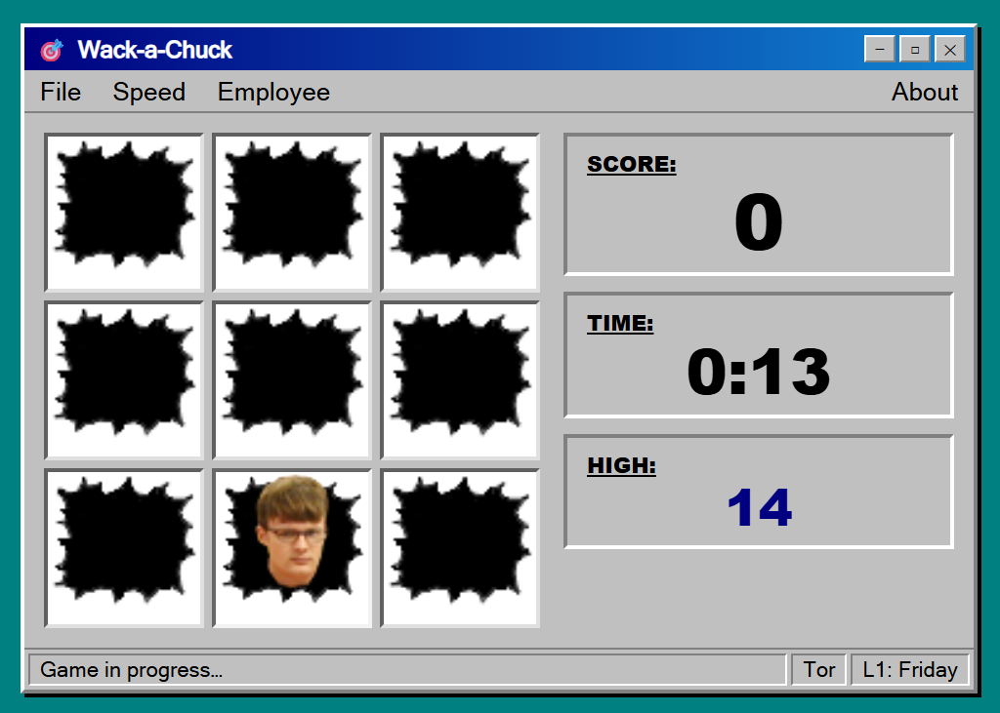

# Wack-a-Chuck

A **Whack-a-Mole** style browser game originally created as an in-office joke in 2002.



---

## How to Play

1. Open `index.html` in any modern browser — no server or install required.
2. Click **File → Start Game** to begin. A face pops out of one of the nine holes.
3. **Click the face** before it ducks back down to score a point.
4. You have **15 seconds**. The timer turns red at 5 seconds remaining.
5. At game over, enter your name to save your score to the leaderboard.

---

## Features

| Feature | Details |
|---|---|
| **Speed levels** | Level 1 (Friday) 750 ms → Level 5 (Monday) 320 ms |
| **Employees** | Chuck, Chris, Sam, Tor — each with their own face |
| **High score** | Persisted in browser `localStorage` |
| **Leaderboard** | Top 10 scores saved locally (name, score, level, date) |
| **Responsive** | Playable on desktop, tablet, and mobile (portrait & landscape) |
| **No dependencies** | Pure HTML, CSS, and JavaScript — no frameworks or build step |

### Speed Levels

| Level | Day | Interval |
|---|---|---|
| 1 | Friday | 750 ms |
| 2 | Thursday | 650 ms |
| 3 | Wednesday | 540 ms |
| 4 | Tuesday | 440 ms |
| 5 | Monday | 320 ms |

---

## History

In **2002**, the game was originally created in **Visual Basic 5** as an in-office joke on a slow afternoon between Christmas and New Year's. Coworkers could "whack" a colleague's face as it popped up from the holes. Two years later, on another slow holiday afternoon, the roster was expanded to include more employees.

In **2026** the game was rewritten from scratch as a single-file web app — same look and feel (Windows 95 aesthetic intentional), same speed levels, same employees — now running in any browser with leaderboard support via `localStorage`.

---

## Files

```
index.html          — the complete game (HTML + CSS + JS, single file)
images/
  hole.png          — empty hole graphic
  chuckN.png        — Chuck, normal
  chuckW.png        — Chuck, whacked
  chrisN.png        — Chris, normal
  chrisW.png        — Chris, whacked
  samN.png          — Sam, normal
  samW.png          — Sam, whacked
  torN.png          — Tor, normal
  torW.png          — Tor, whacked
screenshot.png      — in-game screenshot
```

---

## Original Visual Basic 5 Source (2002)

<details>
<summary>Click to expand the original VB5 form code</summary>

```vb
VERSION 5.00
Begin VB.Form frmMain 
   Appearance      =   0  'Flat
   BackColor       =   &H80000005&
   BorderStyle     =   1  'Fixed Single
   Caption         =   "Wack-EDC"
   ClientHeight    =   2775
   ClientLeft      =   45
   ClientTop       =   660
   ClientWidth     =   4185
   Icon            =   "frmMain.frx":0000
   LinkTopic       =   "Form1"
   MaxButton       =   0   'False
   MinButton       =   0   'False
   ScaleHeight     =   2775
   ScaleWidth      =   4185
   StartUpPosition =   2  'CenterScreen
   Begin VB.Timer Timer1 
      Left            =   -120
      Top             =   2520
   End
   Begin VB.Label lblScore 
      BackColor       =   &H80000014&
      Caption         =   "0"
      BeginProperty Font 
         Name            =   "Arial Black"
         Size            =   27.75
      EndProperty
      Height          =   735
      Left            =   3120
      TabIndex        =   1
      Top             =   600
      Width           =   855
   End
   Begin VB.Label lblScoreheader 
      BackColor       =   &H80000014&
      Caption         =   "SCORE:"
      BeginProperty Font 
         Name            =   "Arial Black"
         Size            =   12
         Underline       =   -1  'True
      EndProperty
      Height          =   375
      Left            =   3000
      TabIndex        =   0
      Top             =   120
      Width           =   1095
   End
   Begin VB.Menu mnuFile 
      Caption         =   "File"
      Begin VB.Menu mnuStart 
         Caption         =   "Start Game"
      End
      Begin VB.Menu mnuStopGame 
         Caption         =   "Stop Game"
      End
      Begin VB.Menu mnuExit 
         Caption         =   "Exit"
      End
   End
   Begin VB.Menu mnuSpeed 
      Caption         =   "Speed"
      Begin VB.Menu mnuSpeed5 
         Caption         =   "Level 5 - Monday"
      End
      Begin VB.Menu mnuSpeed4 
         Caption         =   "Level 4 - Tuesday"
      End
      Begin VB.Menu mnuSpeed3 
         Caption         =   "Level 3 - Wednesday"
      End
      Begin VB.Menu mnuSpeed2 
         Caption         =   "Level 2 - Thursday"
      End
      Begin VB.Menu mnuSpeed1 
         Caption         =   "Level 1 - Friday"
      End
   End
   Begin VB.Menu mnuEmployee 
      Caption         =   "Employee"
      Begin VB.Menu mnuEmployeeChuck 
         Caption         =   "Chuck"
      End
      Begin VB.Menu mnuEmployeeChris 
         Caption         =   "Chris"
      End
      Begin VB.Menu mnuEmployeeSam 
         Caption         =   "Sam"
      End
      Begin VB.Menu mnuEmployeeTor 
         Caption         =   "Tor"
      End
   End
   Begin VB.Menu mnuAbout 
      Caption         =   "About"
      NegotiatePosition=   3  'Right
      WindowList      =   -1  'True
   End
End
Attribute VB_Name = "frmMain"

Option Explicit

Public successWacks As Double
Public totalWacks As Double
Public current_X As Integer
Public current_Y As Integer
Public speedInterval As Integer

Const empChuck = 0
Const empChris = 1
Const empSam = 2
Const empTor = 3

Public intSelectedEmployee As Integer

Private Sub Form_Load()
    mnuSpeed1.Checked = True
    intSelectedEmployee = 3
    mnuEmployeeTor.Checked = True
End Sub

Private Sub Timer1_Timer()
    If mnuSpeed1.Checked Then
        speedInterval = 750
    ElseIf mnuSpeed2.Checked Then
        speedInterval = 650
    ElseIf mnuSpeed3.Checked Then
        speedInterval = 540
    ElseIf mnuSpeed4.Checked Then
        speedInterval = 440
    ElseIf mnuSpeed5.Checked Then
        speedInterval = 320
    End If
    
    Timer1.Interval = speedInterval
    
    ' Hide current mole
    ' ... (set current tile back to hole.bmp)
    
    totalWacks = totalWacks + 1
    
    ' Pick a random tile (0–8 via Rnd mod 9) and show the face
    Select Case Round((Rnd * 100), 0) Mod 9
        Case 1 : imgA1.Picture = LoadPicture(getNormalPictureName()) : current_X = 1 : current_Y = 1
        Case 2 : imgA2.Picture = LoadPicture(getNormalPictureName()) : current_X = 1 : current_Y = 2
        ' ... etc.
    End Select
    
    lblScore.Caption = successWacks
End Sub

Private Sub mnuStart_Click()
    Timer1.Enabled = True
    Timer1.Interval = speedInterval
End Sub

Private Sub mnuStopGame_Click()
    Timer1.Enabled = False
End Sub

Private Function getNormalPictureName() As String
    If intSelectedEmployee = empChuck Then
        getNormalPictureName = App.Path & "\chuckN.bmp"
    ElseIf intSelectedEmployee = empChris Then
        getNormalPictureName = App.Path & "\chrisN.bmp"
    ElseIf intSelectedEmployee = empSam Then
        getNormalPictureName = App.Path & "\samN.bmp"
    Else
        getNormalPictureName = App.Path & "\torN.bmp"
    End If
End Function

Private Function getWackedPictureName() As String
    If intSelectedEmployee = empChuck Then
        getWackedPictureName = App.Path & "\chuckW.bmp"
    ElseIf intSelectedEmployee = empChris Then
        getWackedPictureName = App.Path & "\chrisW.bmp"
    ElseIf intSelectedEmployee = empSam Then
        getWackedPictureName = App.Path & "\samW.bmp"
    Else
        getWackedPictureName = App.Path & "\torW.bmp"
    End If
End Function
```

</details>
